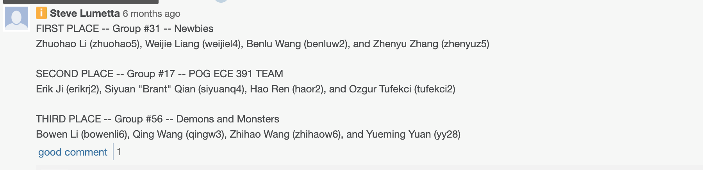

## Features(student-distrib)

### 1. Process Managememnt
   - a. Round-Robin Scheduling
   - b. Re-desigend Completely Linux Fair Scheduler 
   - c. Red Black Self Balanced Tree improve efficiency
### 2. Memory Management
  - a. Usr- memory malloc
  - b. Usr- memmory map
  - c. Dynamically allocating heap- sbrk
  - d. Page fault handler
  - e. Vmalloc
  - f. Kmalloc
    - i. Buddy system
    - ii. Memory cache & Slab allocator
    - iii. Manage data structure in kernel
    
### 3. File System
   - a. Support file system
   - b. Support virtual file system

### 4. Driver
   - a. Keyboard driver
   - b. Real Time Clock driver
   - c. Terminal driver

### 5. System Calls
   - a. fork
   - b. exec
   - c. wait
   - d. exit
   - e. other systemcalls
   
### 6. Interrupts
   - a. Keyboard interrupt
   - b. Timer interrupt
   - c. Real Time Clock interrupt
   - d. Page Fault

### 7. Interface
   - a. Implement shell using fork-exec-wait(asyn)

### 8. Other
   - a. Global Descriptor Table
   - b. Interrupt Descriptor Table
   - c. Task State Segment 
   - d. Paging
   - e. Programmable Interrupt Controller

### 9. Prize
   - 
